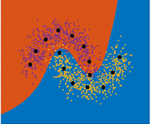
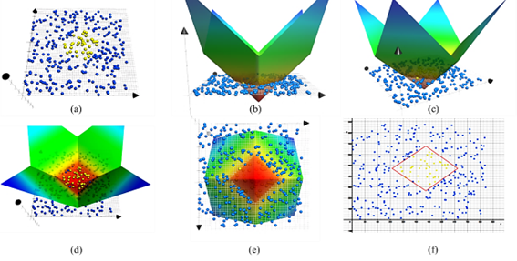

# Multi-Center Polyhedral Classifier (MCPCC)

## Overview

The Multi-Center Polyhedral Classifier (MCPCC) is a machine learning classifier that utilizes multiple centers to define decision boundaries in a multi-dimensional space. The classifier is based on the Polyhedral Conic Classifier (PCC) and the Extended Polyhedral Conic Classifier (EPCC), which are used to define decision boundaries using polyhedral cones. The MCPCC extends these classifiers by allowing multiple centers to be used to define the decision boundaries, which can improve the classifier's performance in complex data sets.

The MCPCC is implemented in Python and is designed to be easy to use and flexible. It supports different classifier types, including PCC, EPCC, and MCPCC, and allows users to configure the distance metrics, penalty coefficients, and number of centers used in the mcpcc classifier. The classifier can be trained on labeled data sets and used to make predictions on new data points.

The below image shows a sample classification using the MCPCC classifier. Black points repsent the calculated centers and the colored points represent the data points. The decision boundaries are determined by the polyhedral conic functions using the centers.



Refer to the [mcpcc paper](https://dergipark.org.tr/tr/download/article-file/1307973) for more details.

For more information on [Polyhedral Conic Classifiers](https://ieeexplore.ieee.org/document/8798888)



## Features

- Supports different classifier types: PCC, EPCC, and MCPCC.
- Configurable distance metrics (L1 and L2).
- Flexible configuration options for penalty coefficients and number of centers.

## Installation

To install the required dependencies, run the following command:

``` bash
pip install -r requirements.txt
```

## Usage

To use the MCPCC in your project, you can import the module as follows:

```python
from mcpcc import MCPCConfig
from mcpcc import MCPCClassifier
```

You can then create a configuration object and initialize the classifier:

```python
config = MCPCConfig(classifier_type="mcpcc", norm_type="L2", num_centers=3)
mcpcc_classifier = MCPCClassifier(config)
```

You can then train the classifier using the `fit` method:

```python
mcpcc_classifier.fit(X_train, y_train)
```

Finally, you can use the classifier to make predictions:

```python
y_pred = mcpcc_classifier.predict(X_test)
```

## Author

Halil Sağlamlar

## License

This project is licensed under the MIT License.
